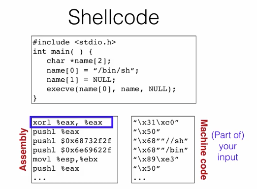

# Buffer Overflow
- A buffer is any contiguous chunk of memory assiociated with a variable value or field
- Overflow refers to any time a program tries to read/write more data than the buffer can hold
- Since most compilers assume that there will only be as much data is needed and allocated, it will read whatever data happens to come next in memory
- Ideally, you would write code to check for out of bounds indexes, as this undefined area can be used maliciously

### Code Injection

###### Loading Code into Memory
- It must be the machine code (assembly language, already compiled and ready to run)
- We have to be careful how we construct it, it can't contain any all zero bytes
  - Because `printf`, `gets`, `scanf`, whatever is used will stop copying over
  - So the challenge is how would you write assembly to never contain a null terminator (all zero byte)
- It can't use the loader, because we're injecting it

###### So what do you do
- Usually the best kind of code to run here would be a general purpose shell
  - This is a command line prompt that gives the attacker general access to the system
- The code to launch this type of shll is called *shellcode*

- The next step is injecting the address to run your function at the `%eip`, this is difficult to find
  - If the address is guessed incorrectly, the program will likely crash
- Since we don't have access to the code, we won't know how far the buffer is from the saved `%ebp`
- One approach is to guess many addresses
- Without address randomization, the stack will always start from the same fixed address
  - Unless the code is heavily recursive, the stack won't grow very deeply
- Another approach is to use a *noop sled*
  - A noop sled is an instruction that just moves the pointer to the next byte
  - Using a bunch of these as padding will make it more likely that the pointer will hit one of your addresses and just move along until it gets to the target code
- This is known as a stack smashing attack
  - This can violate both integrity and availability

### Other Memory Attacks
###### Heap Overflow Attacks
- You can also overflow a buffer allocated by malloc, residing on the heap
- In C++, objects have a vtable, a table of pointers to the methods that an object has
  - Methods in a parent class can be overwritten by a child class
- There is useful object data that may be subject to a buffer overflow attack nearby an objects vtable

###### Integer Overflow Attack
- A variable has a max value, and when it is exceeded it will wrap around
- This can be exploited by forcing a buffer of zero to be allocated
  - Anything put into this buffer afterwards will be overflow

###### Stale Memory
- Memory may be used again after having been freed, and could be accessed maliciously
  - These are often referred to dangling pointers

###### Format String Attack
- A format string is typically the first argument in a  `printf` call
- `%n` is a format string used to print the progress of the `printf` call
  - This could allow the programmer to inject code and cause a `printf` statement to write to a space in memory